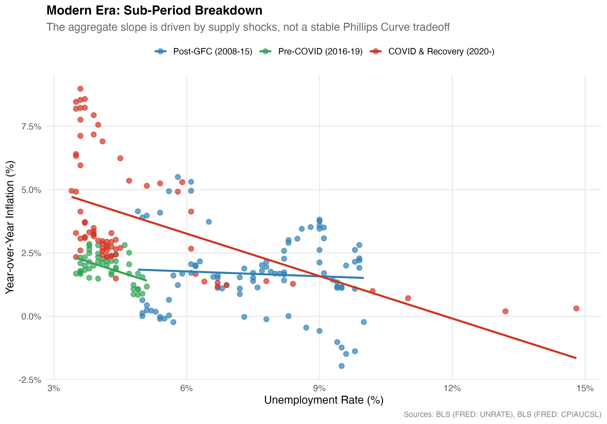
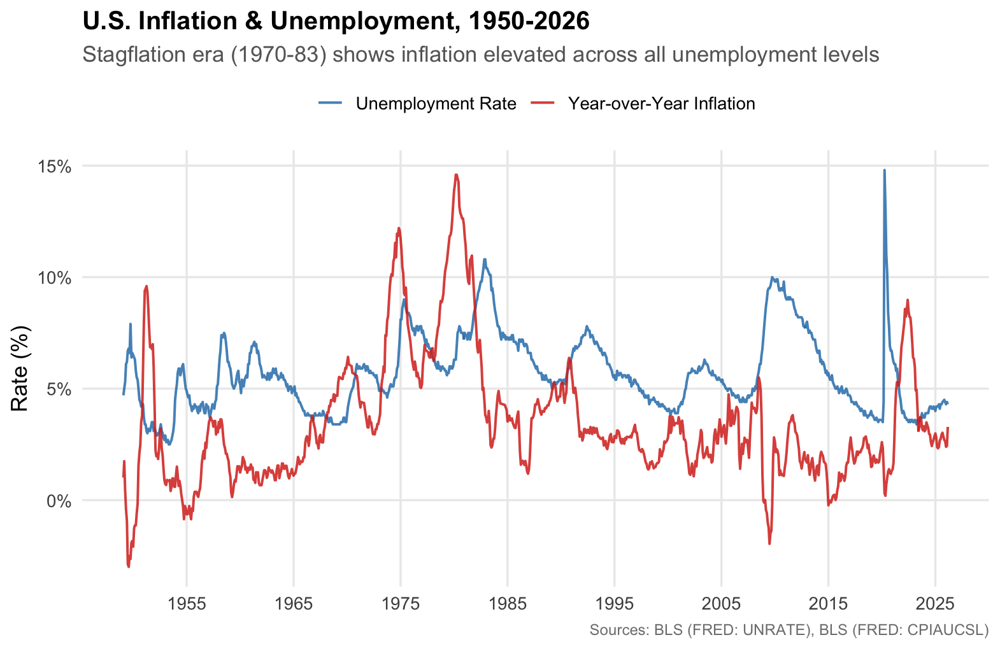
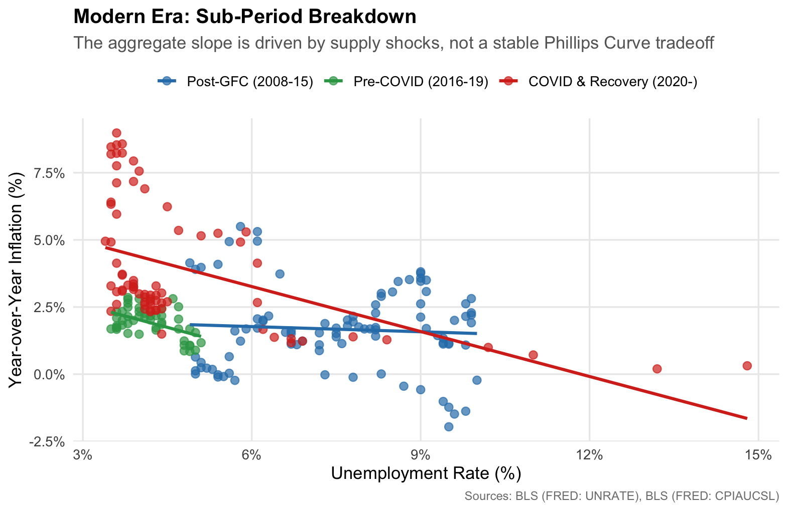

# phillips_curve_analysis.R
Personal project analyzing how the U.S. inflation-unemployment tradeoff has evolved across 75 years of macroeconomic history, using R and publicly available Federal Reserve data (FRED).
# The Phillips Curve: Inflation & Unemployment Across U.S. History

Does low unemployment always mean higher inflation? For decades, economists assumed so. This project tests that assumption using 75+ years of U.S. monthly data, and finds that the answer depends entirely on *when* you look.

## What This Project Does

Using publicly available data from the Federal Reserve (FRED), this analysis tracks the relationship between the U.S. unemployment rate and year-over-year inflation from 1950 to 2026. Rather than treating the full period as a single story, it breaks the data into four distinct macroeconomic eras and runs separate OLS regression models for each, revealing how dramatically the inflation vs. unemployment tradeoff has shifted over time.

## Key Findings

- **Post-War Boom (1950–69):** The classic Phillips Curve holds. A clear negative relationship between unemployment and inflation, consistent with Samuelson and Solow (1960).
- **Stagflation (1970–83):** The tradeoff persists but the curve shifts upward. Oil supply shocks kept inflation elevated across all unemployment levels, not a breakdown of the relationship, but a structural shift in its level.
- **Great Moderation (1984–2007):** The curve flattens significantly. As the Fed anchored inflation expectations, unemployment lost much of its predictive power over inflation, a finding consistent with the broader literature on Phillips Curve flattening post-1984.
- **Modern Era (2008–):** The aggregate slope appears steep and negative, but a sub-period breakdown reveals this is driven by two supply-side shocks: the post-GFC period (high unemployment, near-zero inflation) and the COVID recovery (low unemployment, high inflation), rather than a stable structural tradeoff.

## Charts

## Data Sources

- **Unemployment:** [FRED — UNRATE](https://fred.stlouisfed.org/series/UNRATE) (BLS U-3 Unemployment Rate, monthly)
- **Inflation:** [FRED — CPIAUCSL](https://fred.stlouisfed.org/series/CPIAUCSL) (CPI All Urban Consumers, monthly)

## Tools

R · tidyverse · ggplot2 · broom · scales

## Files

| File | Description |
|------|-------------|
| `phillips_curve_analysis.R` | Full analysis script |
| `UNRATE.csv` | Unemployment rate data (FRED) |
| `CPIAUCSL.csv` | CPI data (FRED) 1948-2026 |
| `plot_a_fullsample.png` | Full-sample Phillips Curve |
| `plot_b_eras.png` | Era breakdown (main chart) |
| `plot_c_timeseries.png` | Time series of both variables |
| `plot_d_modern_era.png` | Modern era sub-period breakdown |
